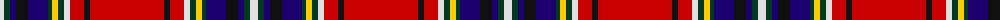

The parent of this is [Strathclyde Fire Services (Corporate](/tartans/ln/8/dg6/db6/k12/db20/dg4/y6/dg6/ln6/r14/k6/r/74/)

This was sourced from tartans-authority.  It is a [12 stripes tartan](/stripes/stripes12/).

Original link http://www.tartansauthority.com/tartan-ferret/display/8469/

## Thread count
LN/8 DG6 DB6 K12 DB20 DG4 Y6 DG6 LN6 R14 K6 R/74

## Palette
Each colour and its ΔE from the base-6 reference it is a variant of.

| Colour | Shade | Base | ΔE (OKLab) |
|---|---|---|---|
| DB |  `#1C0070` | B  | 0.14 |
| DG |  `#003820` | G  | 0.16 |
| K |  `#101010` | K  | 0.17 |
| LN |  `#E0E0E0` | W  | 0.06 |
| R |  `#C80000` | R  | 0.00 |
| Y |  `#FCCC00` | Y  | 0.04 |

ID: /variants/ln/8/dg6/db6/k12/db20/dg4/y6/dg6/ln6/r14/k6/r/74-db1c0070-dg003820-k101010-lne0e0e0-rc80000-yfccc00/
