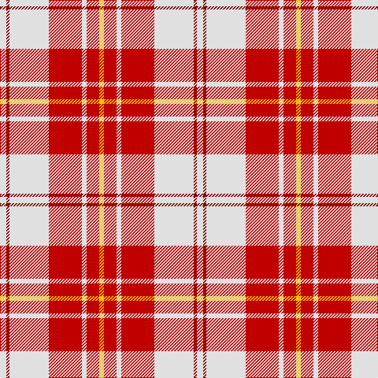

The parent of this is [MacPherson, dress red](/tartans/ln/8/dr4/ln50/r42/ln6/r16/y/6/)

This was sourced from weddslist.  It is a [7 stripes tartan](/stripes/stripes7/).

Original link http://www.weddslist.com/cgi-bin/tartans/pg.pl?source=sts

## Thread count
LN/8 DR4 LN50 R42 LN6 R16 Y/6

## Palette
Each colour and its ΔE from the base-6 reference it is a variant of.

| Colour | Shade | Base | ΔE (OKLab) |
|---|---|---|---|
| DR |  `#800000` | R  | 0.16 |
| LN |  `#E0E0E0` | W  | 0.06 |
| R |  `#C00000` | R  | 0.02 |
| Y |  `#F0C000` | Y  | 0.01 |

# Sample pattern

ID: /variants/ln/8/dr4/ln50/r42/ln6/r16/y/6-dr800000-lne0e0e0-rc00000-yf0c000/
