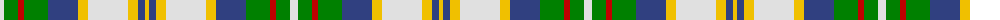

The parent of this is [John, Hamilton Gray](/tartans/ln/8/g14/r6/g24/b30/y10/ln40/y10/b7/y/4/)

This was sourced from weddslist.  It is a [10 stripes tartan](/stripes/stripes10/).

Original link http://www.weddslist.com/cgi-bin/tartans/pg.pl?source=sts

## Thread count
LN/8 G14 R6 G24 B30 Y10 LN40 Y10 B7 Y/4

## Palette
Each colour and its ΔE from the base-6 reference it is a variant of.

| Colour | Shade | Base | ΔE (OKLab) |
|---|---|---|---|
| B |  `#304080` | B  | 0.01 |
| G |  `#008000` | G  | 0.09 |
| LN |  `#E0E0E0` | W  | 0.06 |
| R |  `#C00000` | R  | 0.02 |
| Y |  `#F0C000` | Y  | 0.01 |

ID: /variants/ln/8/g14/r6/g24/b30/y10/ln40/y10/b7/y/4-b304080-g008000-lne0e0e0-rc00000-yf0c000/
