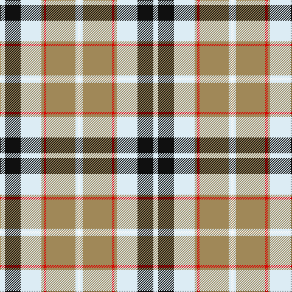

The parent of this is [Lalage (Personal)](/tartans/ln/8/k26/ln34/lt4/r4/lt48/ln4/w/4/)

This was sourced from register-of-tartans.  It is a [8 stripes tartan](/stripes/stripes8/).

Original link https://www.tartanregister.gov.uk/tartanDetails.aspx?ref=2032

## Thread count
LN/8 K26 LN34 LT4 R4 LT48 LN4 W/4

## Palette
Each colour and its ΔE from the base-6 reference it is a variant of.

| Colour | Shade | Base | ΔE (OKLab) |
|---|---|---|---|
| K |  `#101010` | K  | 0.17 |
| LN |  `#DCECF4` | W  | 0.04 |
| LT |  `#A08858` | Y  | 0.21 |
| R |  `#DC0000` | R  | 0.04 |
| W |  `#F8F8F8` | W  | 0.01 |

# Sample pattern

ID: /variants/ln/8/k26/ln34/lt4/r4/lt48/ln4/w/4-k101010-lndcecf4-lta08858-rdc0000-wf8f8f8/
