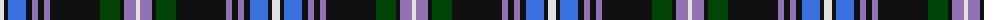

The parent of this is [Auld Lang Syne Blue Fashion Tartan Tartan Number: 7250. Earliest known date: 01/01/2007 No further information. Also called Auld Lang Syne Modern. See products available Copyright © Blair Urquhart, Comrie, 2015](/tartans/ln/8/k4/b18/k6/lp6/k6/lp6/k50/g20/k4/lp12/ln/4/)

This was sourced from house-of-tartan.  It is a [12 stripes tartan](/stripes/stripes12/).

Original link http://www.house-of-tartan.scotland.net/house/TartanViewjs.asp?colr=Def&tnam=7250

## Thread count
LN/8 K4 B18 K6 LP6 K6 LP6 K50 G20 K4 LP12 LN/4

## Palette
Each colour and its ΔE from the base-6 reference it is a variant of.

| Colour | Shade | Base | ΔE (OKLab) |
|---|---|---|---|
| B |  `#3A70DD` | B  | 0.18 |
| G |  `#004505` | G  | 0.10 |
| K |  `#101010` | K  | 0.17 |
| LN |  `#E0E0E0` | W  | 0.06 |
| LP |  `#9173B3` | B  | 0.23 |

ID: /variants/ln/8/k4/b18/k6/lp6/k6/lp6/k50/g20/k4/lp12/ln/4-b3a70dd-g004505-k101010-lne0e0e0-lp9173b3/
