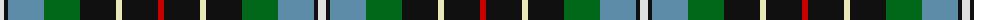

The parent of this is [Hislop (Name)](/tartans/ln/8/k4/b36/g36/k36/w6/k36/r/6/)

This was sourced from tartans-authority.  It is a [8 stripes tartan](/stripes/stripes8/).

Original link http://www.tartansauthority.com/tartan-ferret/display/2137/

## Thread count
LN/8 K4 B36 G36 K36 W6 K36 R/6

## Palette
Each colour and its ΔE from the base-6 reference it is a variant of.

| Colour | Shade | Base | ΔE (OKLab) |
|---|---|---|---|
| B |  `#5C8CA8` | B  | 0.23 |
| G |  `#006818` | G  | 0.02 |
| K |  `#101010` | K  | 0.17 |
| LN |  `#E0E0E0` | W  | 0.06 |
| R |  `#C80000` | R  | 0.00 |
| W |  `#E8E8B8` | W  | 0.07 |

# Sample pattern

ID: /variants/ln/8/k4/b36/g36/k36/w6/k36/r/6-b5c8ca8-g006818-k101010-lne0e0e0-rc80000-we8e8b8/
