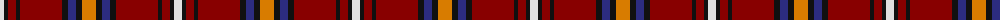

The parent of this is [Castle Stewart (District)](/tartans/ln/8/k4/dr8/k4/dr42/k6/db8/k6/o/14/)

This was sourced from tartans-authority.  It is a [9 stripes tartan](/stripes/stripes9/).

Original link http://www.tartansauthority.com/tartan-ferret/display/7353/

## Thread count
LN/8 K4 DR8 K4 DR42 K6 DB8 K6 O/14

## Palette
Each colour and its ΔE from the base-6 reference it is a variant of.

| Colour | Shade | Base | ΔE (OKLab) |
|---|---|---|---|
| DB |  `#2C2C80` | B  | 0.05 |
| DR |  `#880000` | R  | 0.14 |
| K |  `#101010` | K  | 0.17 |
| LN |  `#E0E0E0` | W  | 0.06 |
| O |  `#D87C00` | Y  | 0.17 |

ID: /variants/ln/8/k4/dr8/k4/dr42/k6/db8/k6/o/14-db2c2c80-dr880000-k101010-lne0e0e0-od87c00/
