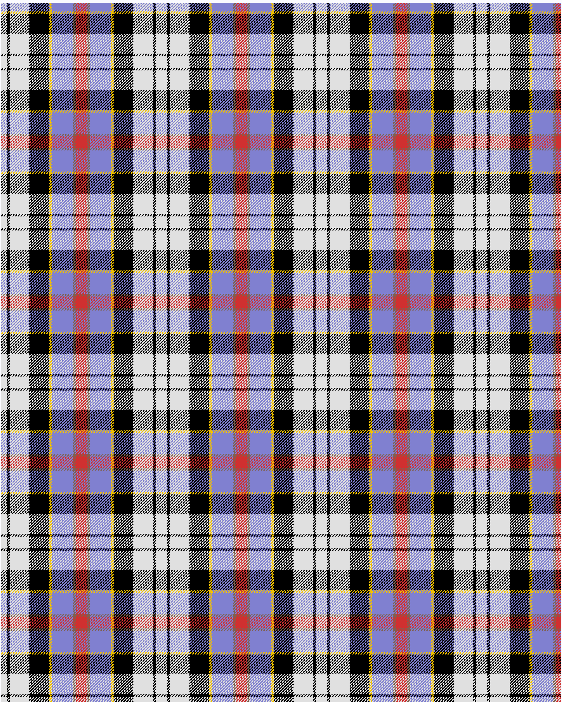

Culloden, Stirling

This was sourced from <no value>.  It is a 8 stripes tartan.

Original link http://www.weddslist.com/cgi-bin/tartans/pg.pl?source=sts

## Thread count
LN/8 K4 LN28 K28 Y4 B30 LT4 R/8

## Palette
B#8080D0 K#000000 LN#E0E0E0 LT#806050 R#D03030 Y#F0C000

# Sample pattern

ID: /variants/ln/8/k4/ln28/k28/y4/b30/lt4/r/8-b8080d0-k000000-lne0e0e0-lt806050-rd03030-yf0c000