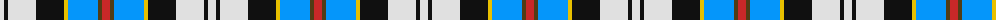
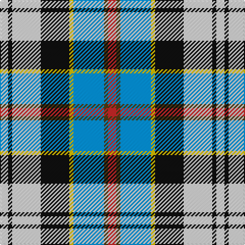

The parent of this is [Culloden Blue, Stirling](/tartans/ln/8/k4/ln28/k28/y4/b30/t4/r/8/)

This was sourced from register-of-tartans.  It is a [8 stripes tartan](/stripes/stripes8/).

Original link https://www.tartanregister.gov.uk/tartanDetails.aspx?ref=821

## Thread count
LN/8 K4 LN28 K28 Y4 B30 T4 R/8

## Palette
Each colour and its ΔE from the base-6 reference it is a variant of.

| Colour | Shade | Base | ΔE (OKLab) |
|---|---|---|---|
| B |  `#0596FA` | B  | 0.28 |
| K |  `#101010` | K  | 0.17 |
| LN |  `#E0E0E0` | W  | 0.06 |
| R |  `#C82828` | R  | 0.03 |
| T |  `#503C14` | G  | 0.15 |
| Y |  `#E8C000` | Y  | 0.00 |

# Sample pattern

ID: /variants/ln/8/k4/ln28/k28/y4/b30/t4/r/8-b0596fa-k101010-lne0e0e0-rc82828-t503c14-ye8c000/
