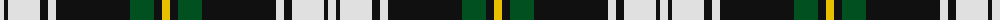

The parent of this is [Gordon Dress (MacGregor-Hastie)](/tartans/ln/8/k4/ln32/k8/ln8/k74/g24/k8/y/8/)

This was sourced from register-of-tartans.  It is a [9 stripes tartan](/stripes/stripes9/).

Original link https://www.tartanregister.gov.uk/tartanDetails.aspx?ref=1459

## Thread count
LN/8 K4 LN32 K8 LN8 K74 G24 K8 Y/8

## Palette
Each colour and its ΔE from the base-6 reference it is a variant of.

| Colour | Shade | Base | ΔE (OKLab) |
|---|---|---|---|
| G |  `#005020` | G  | 0.08 |
| K |  `#101010` | K  | 0.17 |
| LN |  `#E0E0E0` | W  | 0.06 |
| Y |  `#E8C000` | Y  | 0.00 |

ID: /variants/ln/8/k4/ln32/k8/ln8/k74/g24/k8/y/8-g005020-k101010-lne0e0e0-ye8c000/
