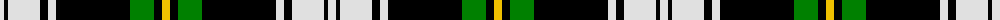

The parent of this is [Gordon, dress 1](/tartans/ln/8/k4/ln32/k8/ln8/k74/g24/k8/y/8/)

This was sourced from weddslist.  It is a [9 stripes tartan](/stripes/stripes9/).

Original link http://www.weddslist.com/cgi-bin/tartans/pg.pl?source=sts

## Thread count
LN/8 K4 LN32 K8 LN8 K74 G24 K8 Y/8

## Palette
Each colour and its ΔE from the base-6 reference it is a variant of.

| Colour | Shade | Base | ΔE (OKLab) |
|---|---|---|---|
| G |  `#008000` | G  | 0.09 |
| K |  `#000000` | K  | 0.00 |
| LN |  `#E0E0E0` | W  | 0.06 |
| Y |  `#F0C000` | Y  | 0.01 |

ID: /variants/ln/8/k4/ln32/k8/ln8/k74/g24/k8/y/8-g008000-k000000-lne0e0e0-yf0c000/
