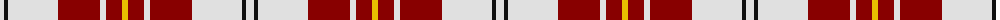

The parent of this is [MacPherson Dress, Burgundy (Dance)](/tartans/ln/8/k4/ln50/dr42/ln6/dr16/y/6/)

This was sourced from tartans-authority.  It is a [7 stripes tartan](/stripes/stripes7/).

Original link http://www.tartansauthority.com/tartan-ferret/display/1832/

## Thread count
LN/8 K4 LN50 DR42 LN6 DR16 Y/6

## Palette
Each colour and its ΔE from the base-6 reference it is a variant of.

| Colour | Shade | Base | ΔE (OKLab) |
|---|---|---|---|
| DR |  `#880000` | R  | 0.14 |
| K |  `#101010` | K  | 0.17 |
| LN |  `#E0E0E0` | W  | 0.06 |
| Y |  `#E8C000` | Y  | 0.00 |

# Sample pattern

ID: /variants/ln/8/k4/ln50/dr42/ln6/dr16/y/6-dr880000-k101010-lne0e0e0-ye8c000/
