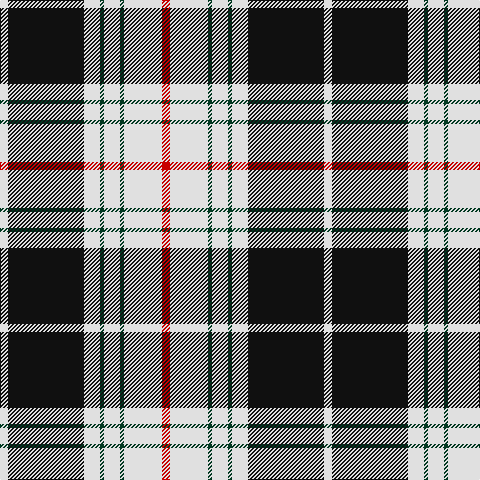

The parent of this is [St Piran Dress District Tartan Tartan Number: 1685. Earliest known date: 1984 Padstow, Cornwall See products available Copyright © Blair Urquhart, Comrie, 2015](/tartans/ln/8/k76/ln16/dg4/ln16/dg4/ln38/r/8/)

This was sourced from house-of-tartan.  It is a [8 stripes tartan](/stripes/stripes8/).

Original link http://www.house-of-tartan.scotland.net/house/TartanViewjs.asp?colr=Def&tnam=1685

## Thread count
LN/8 K76 LN16 DG4 LN16 DG4 LN38 R/8

## Palette
Each colour and its ΔE from the base-6 reference it is a variant of.

| Colour | Shade | Base | ΔE (OKLab) |
|---|---|---|---|
| DG |  `#003820` | G  | 0.16 |
| K |  `#101010` | K  | 0.17 |
| LN |  `#E0E0E0` | W  | 0.06 |
| R |  `#C80000` | R  | 0.00 |

# Sample pattern

ID: /variants/ln/8/k76/ln16/dg4/ln16/dg4/ln38/r/8-dg003820-k101010-lne0e0e0-rc80000/
