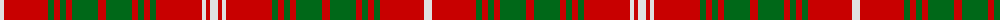

The parent of this is [Duke of Rothesay (Royal)](/tartans/ln/8/r44/g6/r6/g6/r6/g26/r8/g26/r6/g6/r6/g6/r46/ln4/r4/ln/8/)

This was sourced from tartans-authority.  It is a [17 stripes tartan](/stripes/stripes17/).

Original link http://www.tartansauthority.com/tartan-ferret/display/1845/

## Thread count
LN/8 R44 G6 R6 G6 R6 G26 R8 G26 R6 G6 R6 G6 R46 LN4 R4 LN/8

## Palette
Each colour and its ΔE from the base-6 reference it is a variant of.

| Colour | Shade | Base | ΔE (OKLab) |
|---|---|---|---|
| G |  `#006818` | G  | 0.02 |
| LN |  `#E0E0E0` | W  | 0.06 |
| R |  `#C80000` | R  | 0.00 |

ID: /variants/ln/8/r44/g6/r6/g6/r6/g26/r8/g26/r6/g6/r6/g6/r46/ln4/r4/ln/8-g006818-lne0e0e0-rc80000/
