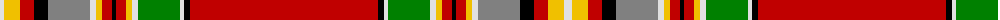

The parent of this is [MacKintosh 8](/tartans/ln/8/y16/r14/k14/n42/ln6/y6/r10/k4/r10/y6/ln6/g42/ln4/k6/r/188/)

This was sourced from weddslist.  It is a [16 stripes tartan](/stripes/stripes16/).

Original link http://www.weddslist.com/cgi-bin/tartans/pg.pl?source=sts

## Thread count
LN/8 Y16 R14 K14 N42 LN6 Y6 R10 K4 R10 Y6 LN6 G42 LN4 K6 R/188

## Palette
Each colour and its ΔE from the base-6 reference it is a variant of.

| Colour | Shade | Base | ΔE (OKLab) |
|---|---|---|---|
| G |  `#008000` | G  | 0.09 |
| K |  `#000000` | K  | 0.00 |
| LN |  `#E0E0E0` | W  | 0.06 |
| N |  `#808080` | G  | 0.22 |
| R |  `#C00000` | R  | 0.02 |
| Y |  `#F0C000` | Y  | 0.01 |

ID: /variants/ln/8/y16/r14/k14/n42/ln6/y6/r10/k4/r10/y6/ln6/g42/ln4/k6/r/188-g008000-k000000-lne0e0e0-n808080-rc00000-yf0c000/
