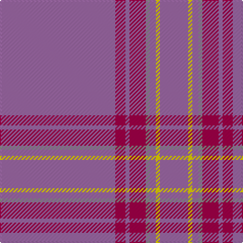

The parent of this is [Cairngorms National Park](/tartans/lp/114/r10/lp4/r16/n4/lp6/y4/lp/28/)

This was sourced from tartans-authority.  It is a [8 stripes tartan](/stripes/stripes8/).

Original link http://www.tartansauthority.com/tartan-ferret/display/11197/

## Thread count
LP/114 R10 LP4 R16 N4 LP6 Y4 LP/28

## Palette
Each colour and its ΔE from the base-6 reference it is a variant of.

| Colour | Shade | Base | ΔE (OKLab) |
|---|---|---|---|
| LP |  `#9C68A4` | R  | 0.21 |
| N |  `#888888` | R  | 0.24 |
| R |  `#A00048` | R  | 0.11 |
| Y |  `#FCCC00` | Y  | 0.04 |

# Sample pattern

ID: /variants/lp/114/r10/lp4/r16/n4/lp6/y4/lp/28-lp9c68a4-n888888-ra00048-yfccc00/
