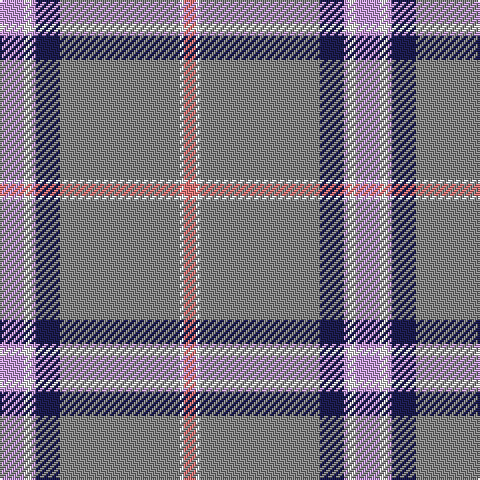

The parent of this is [Kuehle (Personal)](/tartans/lp/12/lna4/lp2/db12/n60/ln2/lr/6/)

This was sourced from tartans-authority.  It is a [7 stripes tartan](/stripes/stripes7/).

Original link http://www.tartansauthority.com/tartan-ferret/display/10063/

## Thread count
LP/12 LNa4 LP2 DB12 N60 LN2 LR/6

## Palette
Each colour and its ΔE from the base-6 reference it is a variant of.

| Colour | Shade | Base | ΔE (OKLab) |
|---|---|---|---|
| DB |  `#1C1C50` | B  | 0.14 |
| LN |  `#DCECF4` | W  | 0.04 |
| LNa |  `#E0E0E0` | W  | 0.06 |
| LP |  `#C49CD8` | W  | 0.24 |
| LR |  `#E87878` | R  | 0.19 |
| N |  `#888888` | R  | 0.24 |

# Sample pattern

ID: /variants/lp/12/lna4/lp2/db12/n60/ln2/lr/6-db1c1c50-lndcecf4-lnae0e0e0-lpc49cd8-lre87878-n888888/
