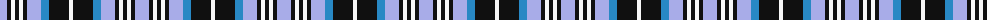

The parent of this is [Investors Group (Corporate)](/tartans/lp/14/k4/w4/k4/w4/k4/lp14/b8/k20/w/4/)

This was sourced from tartans-authority.  It is a [10 stripes tartan](/stripes/stripes10/).

Original link http://www.tartansauthority.com/tartan-ferret/display/6732/

## Thread count
LP/14 K4 W4 K4 W4 K4 LP14 B8 K20 W/4

## Palette
Each colour and its ΔE from the base-6 reference it is a variant of.

| Colour | Shade | Base | ΔE (OKLab) |
|---|---|---|---|
| B |  `#2888C4` | B  | 0.21 |
| K |  `#101010` | K  | 0.17 |
| LP |  `#A8ACE8` | W  | 0.22 |
| W |  `#F8F8F8` | W  | 0.01 |

ID: /variants/lp/14/k4/w4/k4/w4/k4/lp14/b8/k20/w/4-b2888c4-k101010-lpa8ace8-wf8f8f8/
