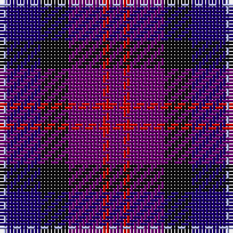

The parent of this is [Kintore (Fashion)](/tartans/lp/2/db10/k8/p10/r2/p/4/)

This was sourced from tartans-authority.  It is a [6 stripes tartan](/stripes/stripes6/).

Original link http://www.tartansauthority.com/tartan-ferret/display/5364/

## Thread count
LP/2 DB10 K8 P10 R2 P/4

## Palette
Each colour and its ΔE from the base-6 reference it is a variant of.

| Colour | Shade | Base | ΔE (OKLab) |
|---|---|---|---|
| DB |  `#1C0070` | B  | 0.14 |
| K |  `#101010` | K  | 0.17 |
| LP |  `#A8ACE8` | W  | 0.22 |
| P |  `#6C0070` | B  | 0.15 |
| R |  `#C80000` | R  | 0.00 |

# Sample pattern

ID: /variants/lp/2/db10/k8/p10/r2/p/4-db1c0070-k101010-lpa8ace8-p6c0070-rc80000/
