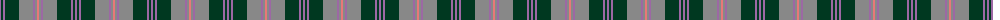
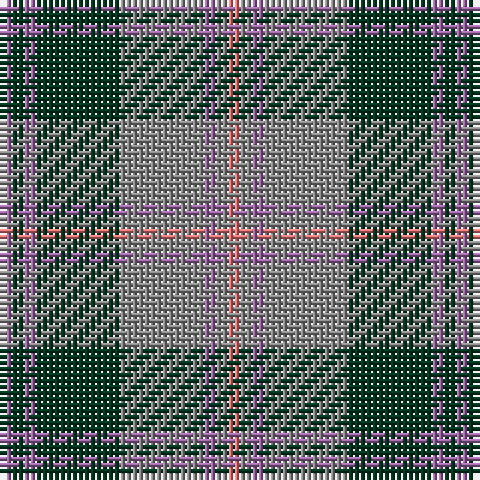

The parent of this is [Beck-McSorley](/tartans/lp/2/dg2/lp2/dg14/n14/lp2/n2/lr/2/)

This was sourced from register-of-tartans.  It is a [8 stripes tartan](/stripes/stripes8/).

Original link https://www.tartanregister.gov.uk/tartanDetails.aspx?ref=11167

## Thread count
LP/2 DG2 LP2 DG14 N14 LP2 N2 LR/2

## Palette
Each colour and its ΔE from the base-6 reference it is a variant of.

| Colour | Shade | Base | ΔE (OKLab) |
|---|---|---|---|
| DG |  `#003820` | G  | 0.16 |
| LP |  `#9C68A4` | R  | 0.21 |
| LR |  `#E87878` | R  | 0.19 |
| N |  `#888888` | R  | 0.24 |

# Sample pattern

ID: /variants/lp/2/dg2/lp2/dg14/n14/lp2/n2/lr/2-dg003820-lp9c68a4-lre87878-n888888/
