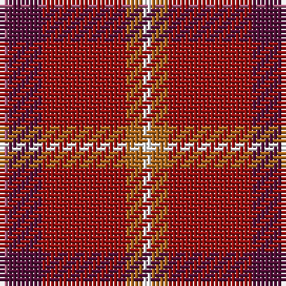

The parent of this is [Love](/tartans/lp/2/dp8/dr20/lt4/w/2/)

This was sourced from register-of-tartans.  It is a [5 stripes tartan](/stripes/stripes5/).

Original link https://www.tartanregister.gov.uk/tartanDetails.aspx?ref=10521

## Thread count
LP/2 DP8 DR20 LT4 W/2

## Palette
Each colour and its ΔE from the base-6 reference it is a variant of.

| Colour | Shade | Base | ΔE (OKLab) |
|---|---|---|---|
| DP |  `#531039` | B  | 0.17 |
| DR |  `#970F0F` | R  | 0.10 |
| LP |  `#A35879` | R  | 0.15 |
| LT |  `#AD681D` | R  | 0.14 |
| W |  `#FFFFFF` | W  | 0.03 |

# Sample pattern

ID: /variants/lp/2/dp8/dr20/lt4/w/2-dp531039-dr970f0f-lpa35879-ltad681d-wffffff/
