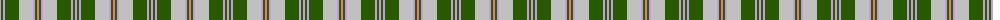
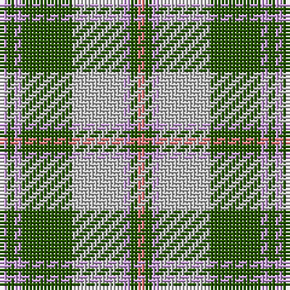

The parent of this is [Beck-McSorley](/tartans/lp/2/g2/lp2/g14/n14/lp2/g2/lr/2/)

This was sourced from tartans-authority.  It is a [8 stripes tartan](/stripes/stripes8/).

Original link http://www.tartansauthority.com/tartan-ferret/display/11167/

## Thread count
LP/2 G2 LP2 G14 N14 LP2 G2 LR/2

## Palette
Each colour and its ΔE from the base-6 reference it is a variant of.

| Colour | Shade | Base | ΔE (OKLab) |
|---|---|---|---|
| G |  `#285800` | G  | 0.04 |
| LP |  `#C49CD8` | W  | 0.24 |
| LR |  `#E87878` | R  | 0.19 |
| N |  `#C0C0C0` | W  | 0.16 |

# Sample pattern

ID: /variants/lp/2/g2/lp2/g14/n14/lp2/g2/lr/2-g285800-lpc49cd8-lre87878-nc0c0c0/
