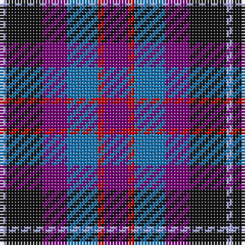

The parent of this is [Benreay Medical Centre](/tartans/lp/2/k12/p8/b10/r2/p/8/)

This was sourced from register-of-tartans.  It is a [6 stripes tartan](/stripes/stripes6/).

Original link https://www.tartanregister.gov.uk/tartanDetails.aspx?ref=5166

## Thread count
LP/2 K12 P8 B10 R2 P/8

## Palette
Each colour and its ΔE from the base-6 reference it is a variant of.

| Colour | Shade | Base | ΔE (OKLab) |
|---|---|---|---|
| B |  `#1474B4` | B  | 0.15 |
| DB |  `#003C64` | B  | 0.07 |
| DBa |  `#2C2C80` | B  | 0.05 |
| DP |  `#440044` | B  | 0.17 |
| DR |  `#680028` | B  | 0.20 |
| K |  `#101010` | K  | 0.17 |
| LP |  `#A8ACE8` | W  | 0.22 |
| P |  `#780078` | B  | 0.16 |
| R |  `#C80000` | R  | 0.00 |

# Sample pattern

ID: /variants/lp/2/k12/p8/b10/r2/p/8-b1474b4-db003c64-dba2c2c80-dp440044-dr680028-k101010-lpa8ace8-p780078-rc80000/
