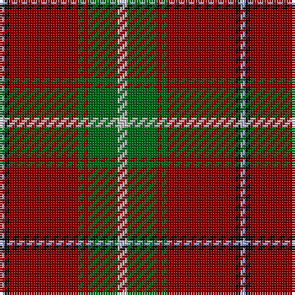

The parent of this is [MacMaster (USA) #1](/tartans/lp/2/k2/dr28/g2/dr2/g12/n/4/)

This was sourced from register-of-tartans.  It is a [7 stripes tartan](/stripes/stripes7/).

Original link https://www.tartanregister.gov.uk/tartanDetails.aspx?ref=5185

## Thread count
LP/2 K2 DR28 G2 DR2 G12 N/4

## Palette
Each colour and its ΔE from the base-6 reference it is a variant of.

| Colour | Shade | Base | ΔE (OKLab) |
|---|---|---|---|
| DR |  `#880000` | R  | 0.14 |
| G |  `#006818` | G  | 0.02 |
| K |  `#101010` | K  | 0.17 |
| LP |  `#A8ACE8` | W  | 0.22 |
| N |  `#C0C0C0` | W  | 0.16 |

# Sample pattern

ID: /variants/lp/2/k2/dr28/g2/dr2/g12/n/4-dr880000-g006818-k101010-lpa8ace8-nc0c0c0/
