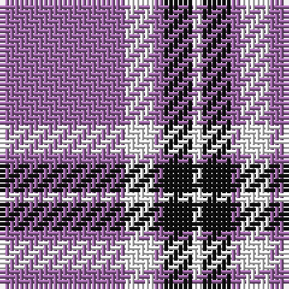

The parent of this is [Glen App (Fashion)](/tartans/lp/26/w6/lp2/k6/w/2/)

This was sourced from tartans-authority.  It is a [5 stripes tartan](/stripes/stripes5/).

Original link http://www.tartansauthority.com/tartan-ferret/display/636/

## Thread count
LP/26 W6 LP2 K6 W/2

## Palette
Each colour and its ΔE from the base-6 reference it is a variant of.

| Colour | Shade | Base | ΔE (OKLab) |
|---|---|---|---|
| K |  `#101010` | K  | 0.17 |
| LP |  `#9C68A4` | R  | 0.21 |
| W |  `#FCFCFC` | W  | 0.03 |

# Sample pattern

ID: /variants/lp/26/w6/lp2/k6/w/2-k101010-lp9c68a4-wfcfcfc/
