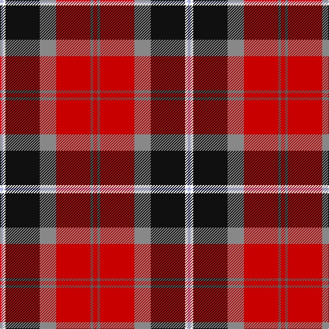

The parent of this is [Bombeiros Voluntarios De Galicia](/tartans/lp/4/w4/k50/na24/r50/n4/r/6/)

This was sourced from register-of-tartans.  It is a [7 stripes tartan](/stripes/stripes7/).

Original link https://www.tartanregister.gov.uk/tartanDetails.aspx?ref=5799

## Thread count
LP/4 W4 K50 Na24 R50 N4 R/6

## Palette
Each colour and its ΔE from the base-6 reference it is a variant of.

| Colour | Shade | Base | ΔE (OKLab) |
|---|---|---|---|
| K |  `#101010` | K  | 0.17 |
| LP |  `#A8ACE8` | W  | 0.22 |
| N |  `#5C5C5C` | B  | 0.14 |
| Na |  `#888888` | R  | 0.24 |
| R |  `#C80000` | R  | 0.00 |
| W |  `#FFFFFF` | W  | 0.03 |

# Sample pattern

ID: /variants/lp/4/w4/k50/na24/r50/n4/r/6-k101010-lpa8ace8-n5c5c5c-na888888-rc80000-wffffff/
