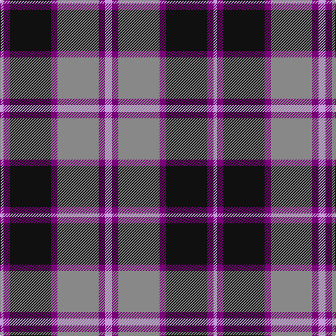

The parent of this is [Central Newcastle High (Corporate)](/tartans/lp/5/p9/k59/p9/n59/p9/lp/10/)

This was sourced from tartans-authority.  It is a [7 stripes tartan](/stripes/stripes7/).

Original link http://www.tartansauthority.com/tartan-ferret/display/7210/

## Thread count
LP/5 P9 K59 P9 N59 P9 LP/10

## Palette
Each colour and its ΔE from the base-6 reference it is a variant of.

| Colour | Shade | Base | ΔE (OKLab) |
|---|---|---|---|
| K |  `#101010` | K  | 0.17 |
| LP |  `#C49CD8` | W  | 0.24 |
| N |  `#888888` | R  | 0.24 |
| P |  `#780078` | B  | 0.16 |

# Sample pattern

ID: /variants/lp/5/p9/k59/p9/n59/p9/lp/10-k101010-lpc49cd8-n888888-p780078/
