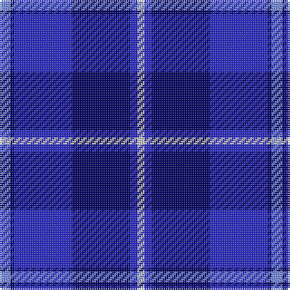

The parent of this is [U.S.S. John Paul Jones #1](/tartans/lp/6/db2/b32/db32/b4/n/4/)

This was sourced from register-of-tartans.  It is a [6 stripes tartan](/stripes/stripes6/).

Original link https://www.tartanregister.gov.uk/tartanDetails.aspx?ref=4193

## Thread count
LP/6 DB2 B32 DB32 B4 N/4

## Palette
Each colour and its ΔE from the base-6 reference it is a variant of.

| Colour | Shade | Base | ΔE (OKLab) |
|---|---|---|---|
| B |  `#2828C8` | B  | 0.12 |
| DB |  `#000064` | B  | 0.17 |
| DR |  `#8C0000` | R  | 0.13 |
| DY |  `#C88C00` | Y  | 0.15 |
| G |  `#007800` | G  | 0.06 |
| K |  `#000000` | K  | 0.00 |
| LP |  `#788CF0` | B  | 0.28 |
| N |  `#C8C8C8` | W  | 0.13 |
| P |  `#64008C` | B  | 0.13 |

# Sample pattern

ID: /variants/lp/6/db2/b32/db32/b4/n/4-b2828c8-db000064-dr8c0000-dyc88c00-g007800-k000000-lp788cf0-nc8c8c8-p64008c/
