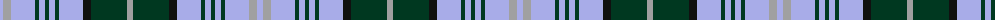

The parent of this is [Breifne (District)](/tartans/lp/6/n8/lp24/dg4/lp6/dg4/lp6/dg4/lp24/k8/dg36/n/6/)

This was sourced from tartans-authority.  It is a [12 stripes tartan](/stripes/stripes12/).

Original link http://www.tartansauthority.com/tartan-ferret/display/7265/

## Thread count
LP/6 N8 LP24 DG4 LP6 DG4 LP6 DG4 LP24 K8 DG36 N/6

## Palette
Each colour and its ΔE from the base-6 reference it is a variant of.

| Colour | Shade | Base | ΔE (OKLab) |
|---|---|---|---|
| DG |  `#003820` | G  | 0.16 |
| K |  `#101010` | K  | 0.17 |
| LP |  `#A8ACE8` | W  | 0.22 |
| N |  `#A0A0A0` | Y  | 0.20 |

ID: /variants/lp/6/n8/lp24/dg4/lp6/dg4/lp6/dg4/lp24/k8/dg36/n/6-dg003820-k101010-lpa8ace8-na0a0a0/
