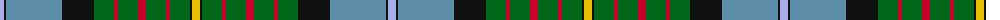

The parent of this is [California State (District)](/tartans/lp/8/k2/b56/k32/g20/r4/g20/r8/g20/r4/g20/k2/y/8/)

This was sourced from tartans-authority.  It is a [13 stripes tartan](/stripes/stripes13/).

Original link http://www.tartansauthority.com/tartan-ferret/display/2454/

## Thread count
LP/8 K2 B56 K32 G20 R4 G20 R8 G20 R4 G20 K2 Y/8

## Palette
Each colour and its ΔE from the base-6 reference it is a variant of.

| Colour | Shade | Base | ΔE (OKLab) |
|---|---|---|---|
| B |  `#5C8CA8` | B  | 0.23 |
| G |  `#006818` | G  | 0.02 |
| K |  `#101010` | K  | 0.17 |
| LP |  `#A8ACE8` | W  | 0.22 |
| R |  `#C8002C` | R  | 0.03 |
| Y |  `#E8C000` | Y  | 0.00 |

ID: /variants/lp/8/k2/b56/k32/g20/r4/g20/r8/g20/r4/g20/k2/y/8-b5c8ca8-g006818-k101010-lpa8ace8-rc8002c-ye8c000/
