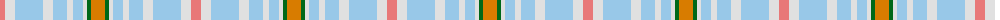

The parent of this is [Peter Rabbit (Corporate)](/tartans/lr/10/ln10/lb28/ln10/lb14/ln6/lb10/ln4/g4/o/14/)

This was sourced from tartans-authority.  It is a [10 stripes tartan](/stripes/stripes10/).

Original link http://www.tartansauthority.com/tartan-ferret/display/10469/

## Thread count
LR/10 LN10 LB28 LN10 LB14 LN6 LB10 LN4 G4 O/14

## Palette
Each colour and its ΔE from the base-6 reference it is a variant of.

| Colour | Shade | Base | ΔE (OKLab) |
|---|---|---|---|
| G |  `#006818` | G  | 0.02 |
| LB |  `#98C8E8` | W  | 0.17 |
| LN |  `#E0E0E0` | W  | 0.06 |
| LR |  `#E87878` | R  | 0.19 |
| O |  `#D87C00` | Y  | 0.17 |

ID: /variants/lr/10/ln10/lb28/ln10/lb14/ln6/lb10/ln4/g4/o/14-g006818-lb98c8e8-lne0e0e0-lre87878-od87c00/
