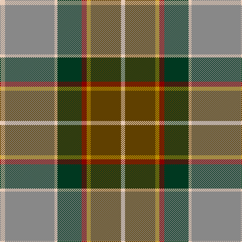

The parent of this is [State Seal of New Mexico (Fashion)](/tartans/lr/10/n98/lr6/dg48/dr10/dy8/t60/lr/8/)

This was sourced from tartans-authority.  It is a [8 stripes tartan](/stripes/stripes8/).

Original link http://www.tartansauthority.com/tartan-ferret/display/8645/

## Thread count
LR/10 N98 LR6 DG48 DR10 DY8 T60 LR/8

## Palette
Each colour and its ΔE from the base-6 reference it is a variant of.

| Colour | Shade | Base | ΔE (OKLab) |
|---|---|---|---|
| DG |  `#003820` | G  | 0.16 |
| DR |  `#880000` | R  | 0.14 |
| DY |  `#BC8C00` | Y  | 0.16 |
| LR |  `#E8CCB8` | W  | 0.11 |
| N |  `#888888` | R  | 0.24 |
| T |  `#604000` | G  | 0.14 |

# Sample pattern

ID: /variants/lr/10/n98/lr6/dg48/dr10/dy8/t60/lr/8-dg003820-dr880000-dybc8c00-lre8ccb8-n888888-t604000/
