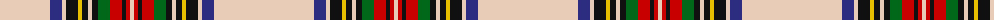

The parent of this is [Stewart Dress (Artefact)](/tartans/lr/100/db12/lr4/k12/y4/k6/lr4/k6/g12/r12/k4/r4/lr/4/)

This was sourced from tartans-authority.  It is a [13 stripes tartan](/stripes/stripes13/).

Original link http://www.tartansauthority.com/tartan-ferret/display/8958/

## Thread count
LR/100 DB12 LR4 K12 Y4 K6 LR4 K6 G12 R12 K4 R4 LR/4

## Palette
Each colour and its ΔE from the base-6 reference it is a variant of.

| Colour | Shade | Base | ΔE (OKLab) |
|---|---|---|---|
| DB |  `#2C2C80` | B  | 0.05 |
| G |  `#006818` | G  | 0.02 |
| K |  `#101010` | K  | 0.17 |
| LR |  `#E8CCB8` | W  | 0.11 |
| R |  `#C80000` | R  | 0.00 |
| Y |  `#E8C000` | Y  | 0.00 |

ID: /variants/lr/100/db12/lr4/k12/y4/k6/lr4/k6/g12/r12/k4/r4/lr/4-db2c2c80-g006818-k101010-lre8ccb8-rc80000-ye8c000/
