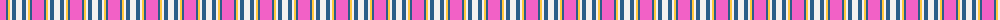
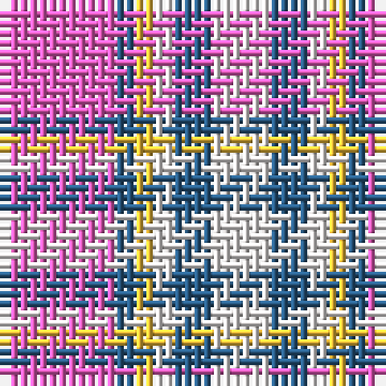

The parent of this is [Winnipeg Embroiderers' Guild](/tartans/lr/12/b2/y2/w2/b4/w/6/)

This was sourced from register-of-tartans.  It is a [6 stripes tartan](/stripes/stripes6/).

Original link https://www.tartanregister.gov.uk/tartanDetails.aspx?ref=10758

## Thread count
LR/12 B2 Y2 W2 B4 W/6

## Palette
Each colour and its ΔE from the base-6 reference it is a variant of.

| Colour | Shade | Base | ΔE (OKLab) |
|---|---|---|---|
| B |  `#2B5E89` | B  | 0.09 |
| LR |  `#F261C6` | R  | 0.25 |
| W |  `#F5F1F0` | W  | 0.01 |
| Y |  `#FFC83C` | Y  | 0.05 |

# Sample pattern

ID: /variants/lr/12/b2/y2/w2/b4/w/6-b2b5e89-lrf261c6-wf5f1f0-yffc83c/
