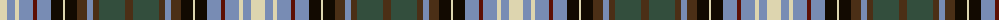

The parent of this is [Redgate (Connecticut) Dress](/tartans/lr/14/b8/lr4/b14/dr4/b14/k12/lr2/k12/t10/b6/t6/n26/t/8/)

This was sourced from register-of-tartans.  It is a [14 stripes tartan](/stripes/stripes14/).

Original link https://www.tartanregister.gov.uk/tartanDetails.aspx?ref=10779

## Thread count
LR/14 B8 LR4 B14 DR4 B14 K12 LR2 K12 T10 B6 T6 N26 T/8

## Palette
Each colour and its ΔE from the base-6 reference it is a variant of.

| Colour | Shade | Base | ΔE (OKLab) |
|---|---|---|---|
| B |  `#788CB4` | B  | 0.25 |
| DR |  `#5D0F04` | B  | 0.22 |
| K |  `#120A01` | K  | 0.15 |
| LR |  `#DDD5AF` | W  | 0.11 |
| N |  `#334E3D` | G  | 0.11 |
| T |  `#4B2F16` | B  | 0.18 |

ID: /variants/lr/14/b8/lr4/b14/dr4/b14/k12/lr2/k12/t10/b6/t6/n26/t/8-b788cb4-dr5d0f04-k120a01-lrddd5af-n334e3d-t4b2f16/
