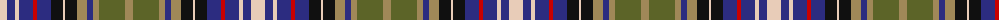

The parent of this is [Redgate Dress (Name)](/tartans/lr/14/db8/lr4/db14/r4/db14/k12/lr2/k12/lt10/db6/lt6/g26/lt/8/)

This was sourced from tartans-authority.  It is a [14 stripes tartan](/stripes/stripes14/).

Original link http://www.tartansauthority.com/tartan-ferret/display/10779/

## Thread count
LR/14 DB8 LR4 DB14 R4 DB14 K12 LR2 K12 LT10 DB6 LT6 G26 LT/8

## Palette
Each colour and its ΔE from the base-6 reference it is a variant of.

| Colour | Shade | Base | ΔE (OKLab) |
|---|---|---|---|
| DB |  `#2C2C80` | B  | 0.05 |
| G |  `#5C6428` | G  | 0.09 |
| K |  `#101010` | K  | 0.17 |
| LR |  `#E8CCB8` | W  | 0.11 |
| LT |  `#A08858` | Y  | 0.21 |
| R |  `#C80000` | R  | 0.00 |

ID: /variants/lr/14/db8/lr4/db14/r4/db14/k12/lr2/k12/lt10/db6/lt6/g26/lt/8-db2c2c80-g5c6428-k101010-lre8ccb8-lta08858-rc80000/
