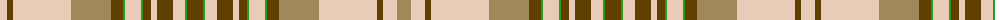

The parent of this is [Isle of Skye (Dalgety)](/tartans/lr/14/t6/lr58/lt40/t12/ga2/lr16/ga2/t8/lr6/t16/lr12/ga2/t16/ga2/lr12/t16/lr6/t8/ga2/lr16/ga2/t12/lt40/lr58/t6/lr14/lt/14/)

This was sourced from register-of-tartans.  It is a [28 stripes tartan](/stripes/stripes28/).

Original link https://www.tartanregister.gov.uk/tartanDetails.aspx?ref=1869

## Thread count
LR/14 T6 LR58 LT40 T12 Ga2 LR16 Ga2 T8 LR6 T16 LR12 Ga2 T16 Ga2 LR12 T16 LR6 T8 Ga2 LR16 Ga2 T12 LT40 LR58 T6 LR14 LT/14

## Palette
Each colour and its ΔE from the base-6 reference it is a variant of.

| Colour | Shade | Base | ΔE (OKLab) |
|---|---|---|---|
| G |  `#408060` | G  | 0.13 |
| Ga |  `#289C18` | G  | 0.18 |
| LR |  `#E8CCB8` | W  | 0.11 |
| LT |  `#A08858` | Y  | 0.21 |
| O |  `#DC943C` | Y  | 0.12 |
| T |  `#604000` | G  | 0.14 |
| Y |  `#D8B000` | Y  | 0.05 |

ID: /variants/lr/14/t6/lr58/lt40/t12/ga2/lr16/ga2/t8/lr6/t16/lr12/ga2/t16/ga2/lr12/t16/lr6/t8/ga2/lr16/ga2/t12/lt40/lr58/t6/lr14/lt/14-g408060-ga289c18-lre8ccb8-lta08858-odc943c-t604000-yd8b000/
