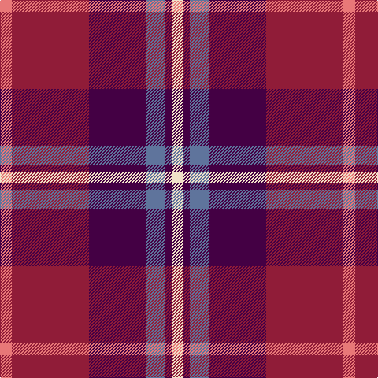

The parent of this is [Afternoon Tea / Assam](/tartans/lr/15/dr98/dp72/b25/dp8/w/15/)

This was sourced from register-of-tartans.  It is a [6 stripes tartan](/stripes/stripes6/).

Original link https://www.tartanregister.gov.uk/tartanDetails.aspx?ref=11279

## Thread count
LR/15 DR98 DP72 B25 DP8 W/15

## Palette
Each colour and its ΔE from the base-6 reference it is a variant of.

| Colour | Shade | Base | ΔE (OKLab) |
|---|---|---|---|
| B |  `#5F749C` | B  | 0.17 |
| DP |  `#440044` | B  | 0.17 |
| DR |  `#901C38` | R  | 0.12 |
| LR |  `#E87878` | R  | 0.19 |
| W |  `#F0E0C8` | W  | 0.06 |

# Sample pattern

ID: /variants/lr/15/dr98/dp72/b25/dp8/w/15-b5f749c-dp440044-dr901c38-lre87878-wf0e0c8/
