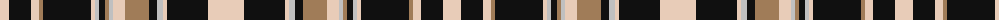

The parent of this is [Abergavenny](/tartans/lr/18/k22/lr8/lt4/k48/lr4/n4/k6/lt4/n4/lr12/lt24/k8/n6/lr4/k41/lr/36/)

This was sourced from register-of-tartans.  It is a [17 stripes tartan](/stripes/stripes17/).

Original link https://www.tartanregister.gov.uk/tartanDetails.aspx?ref=4885

## Thread count
LR/18 K22 LR8 LT4 K48 LR4 N4 K6 LT4 N4 LR12 LT24 K8 N6 LR4 K41 LR/36

## Palette
Each colour and its ΔE from the base-6 reference it is a variant of.

| Colour | Shade | Base | ΔE (OKLab) |
|---|---|---|---|
| K |  `#101010` | K  | 0.17 |
| LR |  `#E8CCB8` | W  | 0.11 |
| LT |  `#A07C58` | R  | 0.19 |
| N |  `#C0C0C0` | W  | 0.16 |

ID: /variants/lr/18/k22/lr8/lt4/k48/lr4/n4/k6/lt4/n4/lr12/lt24/k8/n6/lr4/k41/lr/36-k101010-lre8ccb8-lta07c58-nc0c0c0/
