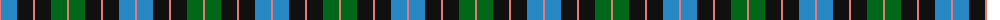
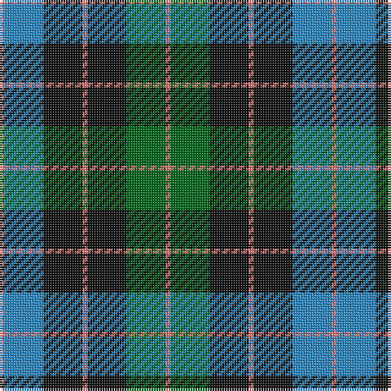

The parent of this is [Triad Highland Games (Corporate)](/tartans/lr/2/b16/k16/lr2/k16/g16/lr/2/)

This was sourced from tartans-authority.  It is a [7 stripes tartan](/stripes/stripes7/).

Original link http://www.tartansauthority.com/tartan-ferret/display/6527/

## Thread count
LR/2 B16 K16 LR2 K16 G16 LR/2

## Palette
Each colour and its ΔE from the base-6 reference it is a variant of.

| Colour | Shade | Base | ΔE (OKLab) |
|---|---|---|---|
| B |  `#2888C4` | B  | 0.21 |
| G |  `#006818` | G  | 0.02 |
| K |  `#101010` | K  | 0.17 |
| LR |  `#E87878` | R  | 0.19 |

# Sample pattern

ID: /variants/lr/2/b16/k16/lr2/k16/g16/lr/2-b2888c4-g006818-k101010-lre87878/
