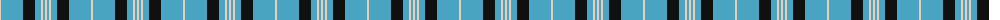
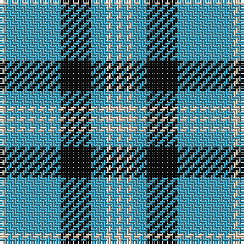

The parent of this is [Angle, Blue (Fashion)](/tartans/lr/2/b22/k12/b6/lr2/b2/lr/2/)

This was sourced from tartans-authority.  It is a [7 stripes tartan](/stripes/stripes7/).

Original link http://www.tartansauthority.com/tartan-ferret/display/3512/

## Thread count
LR/2 B22 K12 B6 LR2 B2 LR/2

## Palette
Each colour and its ΔE from the base-6 reference it is a variant of.

| Colour | Shade | Base | ΔE (OKLab) |
|---|---|---|---|
| B |  `#48A4C0` | Y  | 0.28 |
| K |  `#101010` | K  | 0.17 |
| LR |  `#E8CCB8` | W  | 0.11 |

# Sample pattern

ID: /variants/lr/2/b22/k12/b6/lr2/b2/lr/2-b48a4c0-k101010-lre8ccb8/
