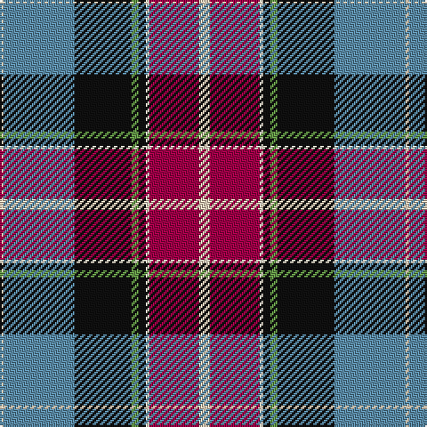

The parent of this is [Vinther, Niels Christian (Personal)](/tartans/lr/2/b40/k32/lg4/k4/w2/r28/lr/6/)

This was sourced from register-of-tartans.  It is a [8 stripes tartan](/stripes/stripes8/).

Original link https://www.tartanregister.gov.uk/tartanDetails.aspx?ref=11539

## Thread count
LR/2 B40 K32 LG4 K4 W2 R28 LR/6

## Palette
Each colour and its ΔE from the base-6 reference it is a variant of.

| Colour | Shade | Base | ΔE (OKLab) |
|---|---|---|---|
| B |  `#5C8CA8` | B  | 0.23 |
| K |  `#101010` | K  | 0.17 |
| LG |  `#649848` | G  | 0.19 |
| LR |  `#E8CCB8` | W  | 0.11 |
| R |  `#A00048` | R  | 0.11 |
| W |  `#F0E0C8` | W  | 0.06 |

# Sample pattern

ID: /variants/lr/2/b40/k32/lg4/k4/w2/r28/lr/6-b5c8ca8-k101010-lg649848-lre8ccb8-ra00048-wf0e0c8/
