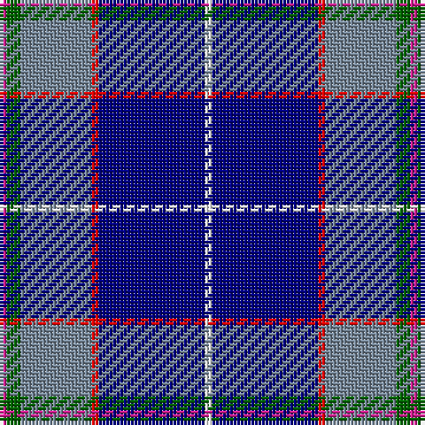

The parent of this is [Oren Peterson](/tartans/lr/2/g4/n20/r2/db30/w/2/)

This was sourced from register-of-tartans.  It is a [6 stripes tartan](/stripes/stripes6/).

Original link https://www.tartanregister.gov.uk/tartanDetails.aspx?ref=10127

## Thread count
LR/2 G4 N20 R2 DB30 W/2

## Palette
Each colour and its ΔE from the base-6 reference it is a variant of.

| Colour | Shade | Base | ΔE (OKLab) |
|---|---|---|---|
| DB |  `#000080` | B  | 0.14 |
| G |  `#006400` | G  | 0.00 |
| LR |  `#D02090` | R  | 0.16 |
| N |  `#778899` | B  | 0.24 |
| R |  `#FF0000` | R  | 0.11 |
| W |  `#FFFFFF` | W  | 0.03 |

# Sample pattern

ID: /variants/lr/2/g4/n20/r2/db30/w/2-db000080-g006400-lrd02090-n778899-rff0000-wffffff/
