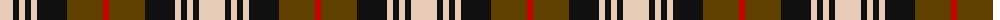

The parent of this is [Holden Brown (Corporate)](/tartans/lr/26/k6/lr6/k6/lr6/k30/t36/r/6/)

This was sourced from tartans-authority.  It is a [8 stripes tartan](/stripes/stripes8/).

Original link http://www.tartansauthority.com/tartan-ferret/display/8679/

## Thread count
LR/26 K6 LR6 K6 LR6 K30 T36 R/6

## Palette
Each colour and its ΔE from the base-6 reference it is a variant of.

| Colour | Shade | Base | ΔE (OKLab) |
|---|---|---|---|
| K |  `#101010` | K  | 0.17 |
| LR |  `#E8CCB8` | W  | 0.11 |
| R |  `#C80000` | R  | 0.00 |
| T |  `#604000` | G  | 0.14 |

# Sample pattern

ID: /variants/lr/26/k6/lr6/k6/lr6/k30/t36/r/6-k101010-lre8ccb8-rc80000-t604000/
