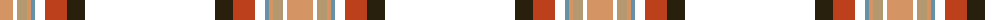

The parent of this is [Down Irish County Tartan Tartan Number: 2266. Earliest known date: 1995 One of a series of Irish District tartans designed by Polly Wittering of the House of Edgar, with colours reminiscent of the Country with soft warm colours dominating. See products available Copyright © Blair Urquhart, Comrie, 2015](/tartans/lr/26/t4/lt10/lr4/b4/t10/r22/k18/t/130/)

This was sourced from house-of-tartan.  It is a [9 stripes tartan](/stripes/stripes9/).

Original link http://www.house-of-tartan.scotland.net/house/TartanViewjs.asp?colr=Def&tnam=2266

## Thread count
LR/26 T4 LT10 LR4 B4 T10 R22 K18 T/130

## Palette
Each colour and its ΔE from the base-6 reference it is a variant of.

| Colour | Shade | Base | ΔE (OKLab) |
|---|---|---|---|
| B |  `#6490A8` | B  | 0.25 |
| G |  `#005448` | G  | 0.11 |
| K |  `#28200C` | B  | 0.21 |
| LR |  `#D49464` | Y  | 0.15 |
| LT |  `#B49870` | Y  | 0.16 |
| R |  `#BC401C` | R  | 0.06 |

ID: /variants/lr/26/t4/lt10/lr4/b4/t10/r22/k18/t/130-b6490a8-g005448-k28200c-lrd49464-ltb49870-rbc401c/
