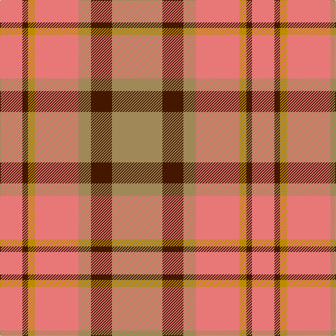

The parent of this is [Manhattan Ethnic (Fashion)](/tartans/lr/32/dr8/dy10/lr62/lt18/dr30/lt/72/)

This was sourced from tartans-authority.  It is a [7 stripes tartan](/stripes/stripes7/).

Original link http://www.tartansauthority.com/tartan-ferret/display/2604/

## Thread count
LR/32 DR8 DY10 LR62 LT18 DR30 LT/72

## Palette
Each colour and its ΔE from the base-6 reference it is a variant of.

| Colour | Shade | Base | ΔE (OKLab) |
|---|---|---|---|
| DR |  `#441800` | B  | 0.22 |
| DY |  `#BC8C00` | Y  | 0.16 |
| LR |  `#E87878` | R  | 0.19 |
| LT |  `#A08858` | Y  | 0.21 |

# Sample pattern

ID: /variants/lr/32/dr8/dy10/lr62/lt18/dr30/lt/72-dr441800-dybc8c00-lre87878-lta08858/
