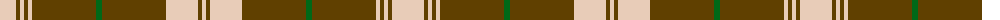

The parent of this is [MacLachlan, Brown Dress (Fashion)](/tartans/lr/32/t4/lr4/t4/lr4/t32/t32/g6/t32/t32/lr32/t4/lr/4/)

This was sourced from tartans-authority.  It is a [13 stripes tartan](/stripes/stripes13/).

Original link http://www.tartansauthority.com/tartan-ferret/display/8827/

## Thread count
LR/32 T4 LR4 T4 LR4 T32 T32 G6 T32 T32 LR32 T4 LR/4

## Palette
Each colour and its ΔE from the base-6 reference it is a variant of.

| Colour | Shade | Base | ΔE (OKLab) |
|---|---|---|---|
| G |  `#006818` | G  | 0.02 |
| LR |  `#E8CCB8` | W  | 0.11 |
| T |  `#604000` | G  | 0.14 |

ID: /variants/lr/32/t4/lr4/t4/lr4/t32/t32/g6/t32/t32/lr32/t4/lr/4-g006818-lre8ccb8-t604000/
