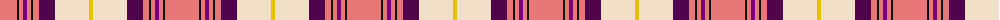

The parent of this is [Kyle, Pink (Dance)](/tartans/lr/34/k2/lr4/p4/lr4/k2/lr6/dp16/w34/y/4/)

This was sourced from tartans-authority.  It is a [10 stripes tartan](/stripes/stripes10/).

Original link http://www.tartansauthority.com/tartan-ferret/display/7588/

## Thread count
LR/34 K2 LR4 P4 LR4 K2 LR6 DP16 W34 Y/4

## Palette
Each colour and its ΔE from the base-6 reference it is a variant of.

| Colour | Shade | Base | ΔE (OKLab) |
|---|---|---|---|
| DP |  `#50044C` | B  | 0.16 |
| K |  `#101010` | K  | 0.17 |
| LR |  `#E87878` | R  | 0.19 |
| P |  `#780078` | B  | 0.16 |
| W |  `#F0E0C8` | W  | 0.06 |
| Y |  `#E8C000` | Y  | 0.00 |

ID: /variants/lr/34/k2/lr4/p4/lr4/k2/lr6/dp16/w34/y/4-dp50044c-k101010-lre87878-p780078-wf0e0c8-ye8c000/
