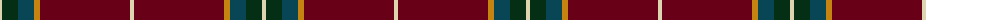

The parent of this is [Glencross (Moniaive) (Personal)](/tartans/lr/4/dg16/db16/dy6/dr90/lr/4/)

This was sourced from register-of-tartans.  It is a [6 stripes tartan](/stripes/stripes6/).

Original link https://www.tartanregister.gov.uk/tartanDetails.aspx?ref=10843

## Thread count
LR/4 DG16 DB16 DY6 DR90 LR/4

## Palette
Each colour and its ΔE from the base-6 reference it is a variant of.

| Colour | Shade | Base | ΔE (OKLab) |
|---|---|---|---|
| DB |  `#084555` | B  | 0.09 |
| DG |  `#052F14` | G  | 0.19 |
| DR |  `#680018` | B  | 0.21 |
| DY |  `#C58310` | Y  | 0.17 |
| LR |  `#DDD5AF` | W  | 0.11 |

# Sample pattern

ID: /variants/lr/4/dg16/db16/dy6/dr90/lr/4-db084555-dg052f14-dr680018-dyc58310-lrddd5af/
