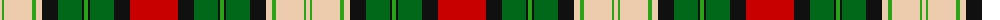

The parent of this is [Hohenzollern Staff (Personal)](/tartans/lr/4/g2/lr28/g4/lr6/k16/ga24/k2/g4/k2/ga24/k16/r/48/)

This was sourced from tartans-authority.  It is a [13 stripes tartan](/stripes/stripes13/).

Original link http://www.tartansauthority.com/tartan-ferret/display/7154/

## Thread count
LR/4 G2 LR28 G4 LR6 K16 Ga24 K2 G4 K2 Ga24 K16 R/48

## Palette
Each colour and its ΔE from the base-6 reference it is a variant of.

| Colour | Shade | Base | ΔE (OKLab) |
|---|---|---|---|
| G |  `#2CA418` | G  | 0.20 |
| Ga |  `#006818` | G  | 0.02 |
| K |  `#101010` | K  | 0.17 |
| LR |  `#ECCCAC` | W  | 0.11 |
| R |  `#C80000` | R  | 0.00 |

ID: /variants/lr/4/g2/lr28/g4/lr6/k16/ga24/k2/g4/k2/ga24/k16/r/48-g2ca418-ga006818-k101010-lrecccac-rc80000/
